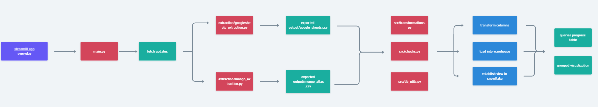

# readme-sections

These are just suggestions, you can tune it to your liking and the goals of your project.

- **Introduction**: Introduction of your project. You can
- **Dataset / Data source** - Source of your data. What data you are working with and the origin of your data (kaggle, webscraping, etc.)
- **Workflow/Methodology** - Methodology, steps followed to achieve the project, libraries used, etc.
- **Goals/Hypothesis** - Project goals / Initial hypothesis
- **Analysis** - Insights, patterns, relations found in the data, etc.
- **Results** - Results of the analysis (visualizations, validation of hypothesis, etc.)
- **Conclusion** - Conclusions of the project
- **Next steps**
- **Links** - Links of interest to support the project
- Maybe make use of schemas like the one below [whimsical](whimsical.com):

